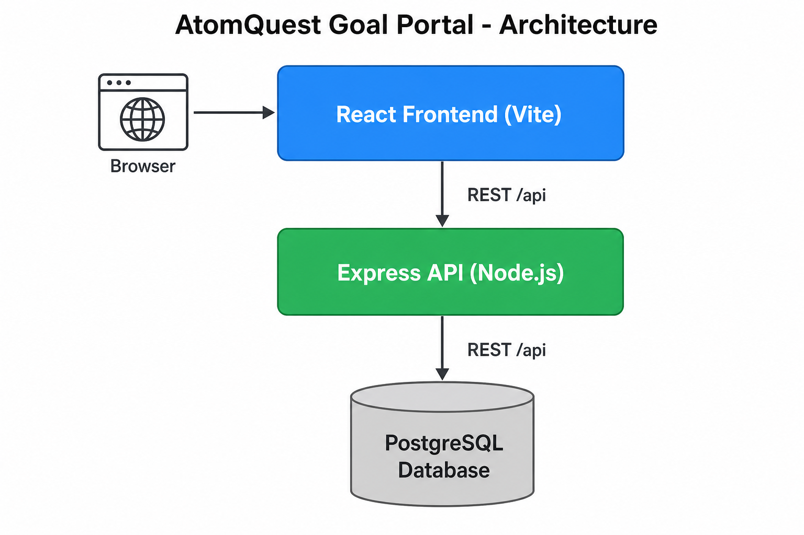

# AtomQuest — Hackathon Submission

> **For PDF:** Open **SUBMISSION.html** in Chrome → Print → Save as PDF (diagram is embedded).

---

## Problem statement

**ATOMQUEST HACKATHON 1.0 — In-House Goal Setting & Tracking Portal**

Organizations using spreadsheets and email for goals lack real-time alignment and audit-ready data. The hackathon asks for a **web portal** that supports the full goal lifecycle:

**Phase 1 — Goal creation & approval**
- Employees create a goal sheet (thrust area, title, UoM, target, weightage).
- Rules: max **8** goals, min **10%** each, total weightage **100%**.
- Manager (L1) reviews, edits targets/weightage, approves or returns for rework; approved goals are **locked**.
- **Shared goals:** admin/manager push a KPI to many employees; title/target read-only; owner syncs actuals.

**Phase 2 — Achievement & quarterly check-ins**
- Employees log **planned vs actual** each quarter with status (Not Started / On Track / Completed).
- Managers add check-in comments.
- **Progress scores** by UoM (Min/Max numeric, Timeline, Zero-based) — tracking only, not ratings.

**BRD §2.3 — Quarterly windows**
- Goal setting: May–June · Q1: July · Q2: October · Q3: January · Q4/Annual: March–April

**Roles:** Employee · Manager (L1) · Admin/HR (cycles, analytics, audit, unlock).

**Deliverables:** hosted demo, public repo, architecture diagram, logins for all three roles.

---

## Our solution

We built a **full-stack portal** (React + Express + PostgreSQL) deployed on **Render** with Docker.

| Requirement | How we solved it |
|-------------|------------------|
| Goal sheets & validation | Employee dashboard; server-side checks for 8 goals, 10% min, 100% total |
| UoM & scoring | Numeric, %, Timeline, Zero-based with explicit **Min/Max** direction and BRD formulas |
| Manager approval | Team review page — approve/rework, inline edits while reviewing, sheet lock/unlock |
| Shared KPIs | Admin/manager push shared goals; clones stay read-only on title/target |
| Quarterly check-ins | Quarter tabs, actuals + status; manager comments; scores computed automatically |
| BRD §2.3 windows | `cycleWindows` + Admin cycle settings; demo mode for hackathon testing |
| Admin & reporting | Analytics charts, CSV export, audit logs, unlock sheets, cycle enforcement toggle |
| Security & roles | JWT auth, role-based API routes, goal/check-in access checks |
| Go live | Single production image (`Dockerfile.prod`); auto-migrate DB and seed demo users on first deploy |
| Good-to-have §5 | Notifications + deep links; escalation rules; QoQ analytics; Entra ID demo SSO; Teams webhook hook |

**Stack:** React (Vite) · Node.js (Express) · PostgreSQL · Docker · **Render** (https://atomquest-portal-9u7c.onrender.com)

---

## Links

- **Live demo:** https://atomquest-portal-9u7c.onrender.com  
- **GitHub:** https://github.com/prathmeshkulkarni-coder/atomquest-portal  

## Architecture

## Demo logins

**Password (all accounts):** `password123`

| Role | Email |
|------|-------|
| Employee | employee@atomquest.com |
| Manager | manager@atomquest.com |
| Admin | admin@atomquest.com |
