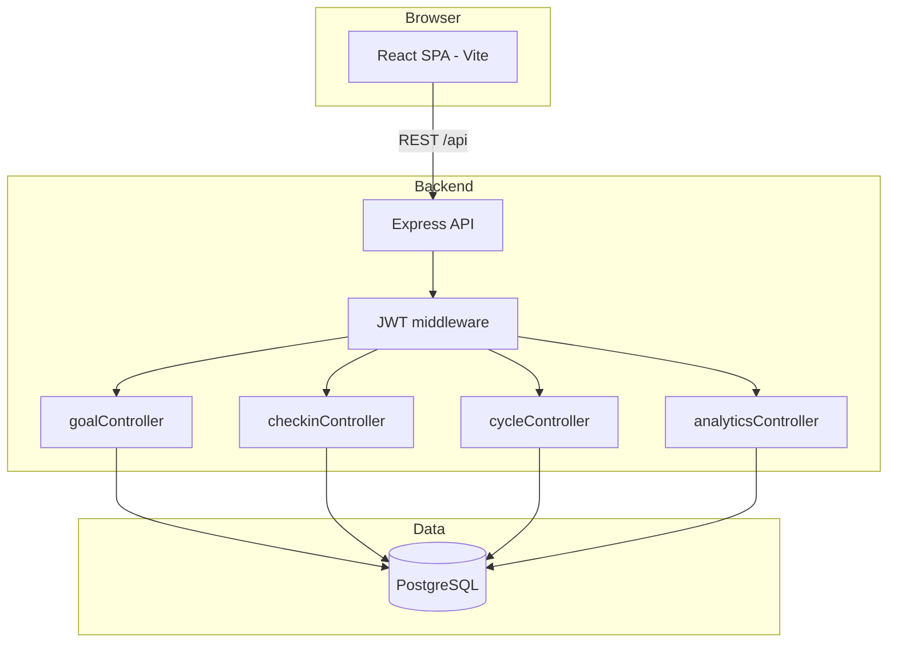

# AtomQuest Portal — Architecture

## System overview

## BRD §2.3 — Cycle enforcement

| Window | Calendar period | Allowed actions |
| :--- | :--- | :--- |
| Goal Setting & Approval | 1 May – 30 Jun | Create/edit/delete goals, submit sheet, manager review, shared KPI push |
| Q1 check-in | July | Log actuals & status for Q1 |
| Q2 check-in | October | Q2 check-ins |
| Q3 check-in | January | Q3 check-ins |
| Q4 / Annual | March – April | Q4 and Annual check-ins |

Enforcement is controlled by `cycle_settings` (Admin UI) and `CYCLE_DEMO_MODE` (Docker env). When bypass is active, all windows behave as open for demos.

## Scoring (explicit UoM direction)

Goals store `uom` and `uom_direction` (`Min` | `Max`, null for Timeline / Zero-based). The score calculator uses direction instead of inferring from goal title keywords.

## Repository layout

| Path | Role |
| :--- | :--- |
| `frontend/` | React UI, Vitest component tests |
| `backend/` | Express API, Node test runner |
| `docker-compose.yml` | Postgres + API + UI |
| `docs/architecture.md` | This document |
